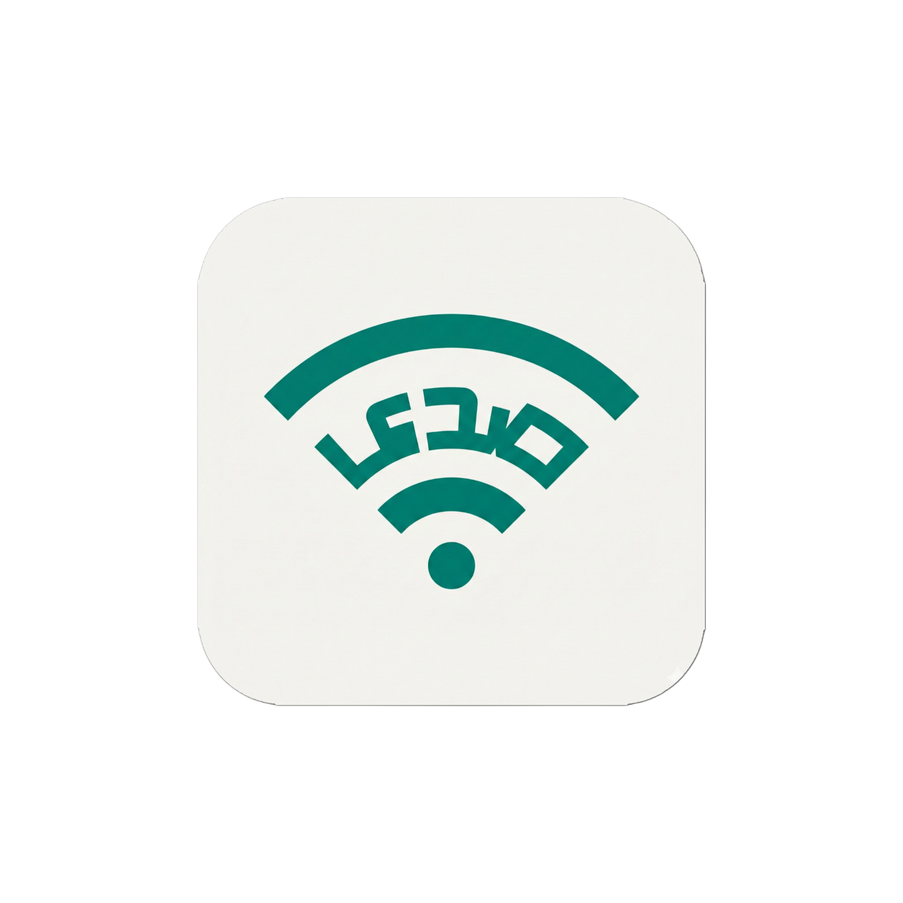

<p align="center">
  
</p>

<h1 align="center">Sada (صدى)</h1>
<p align="center">
  <strong>بنية تحتية رقمية للتواصل المجتمعي — تعمل بدون إنترنت</strong><br/>
  <em>Community Communication Platform for Crisis & Infrastructure-Poor Regions</em>
</p>

<p align="center">
  
  
  
  
  
  
  
</p>

> **⚠️ Alpha Software — Active Development**
>
> Sada is in active development. The first field test has not been completed yet.
> Do not rely on this app as your only communication channel.

---

## 📖 ما هي صدى؟

**صدى** (Sada) هي منصة تواصل مجتمعية لا مركزية تعمل **بدون إنترنت**. عندما تنقطع الخدمات — كهرباء، إنترنت، أبراج اتصال — تبقى صدى تعمل عبر شبكة Mesh محلية تربط الأجهزة ببعضها مباشرة.

**Sada** is a decentralized, offline mesh communication platform. When infrastructure fails — power outages, internet disruptions, tower damage — Sada keeps communities connected through local mesh networking.

### 🌍 لماذا صدى؟

في سوريا والمناطق ذات البنية التحتية المتدهورة:
- ⚡ الكهرباء تنقطع لساعات يومياً
- 📡 الإنترنت غير مستقر أو غير متوفر
- 📱 أبراج الاتصال متضررة أو محدودة التغطية
- 🏥 التنسيق في الكوارث (زلازل، فيضانات) يحتاج بديل فوري

**صدى تحل هذه المشكلة** — شبكة تواصل محلية تعمل بين الجيران والأحياء بدون أي بنية تحتية خارجية.

---

## ✨ الميزات الرئيسية

### 📡 شبكة Mesh متعددة الطبقات
- **WiFi Direct (P2P)**: اتصال مباشر بين الأجهزة القريبة (حتى 200م)
- **LoRa 868MHz** *(قيد التطوير)*: مدى طويل حتى 5 كم في البيئة الحضرية عبر Heltec WiFi LoRa 32
- **Store-Carry-Forward**: الرسائل تُخزَّن وتُنقل عبر أجهزة وسيطة حتى تصل لوجهتها

### 🔒 خصوصية احترافية
- **تشفير End-to-End**: X25519 + XSalsa20-Poly1305 عبر libsodium
- **بدون خوادم**: لا يوجد سيرفر مركزي — كل البيانات محلية
- **مفتوح المصدر**: يمكن لأي شخص مراجعة الكود

### 🔋 مُحسَّن للبطارية
- **Duty Cycling ذكي**: يُكيّف معدل الاكتشاف حسب مستوى البطارية
- **3 أوضاع طاقة**: أداء عالي / متوازن / توفير طاقة
- **خدمة خلفية خفيفة**: تعمل بدون استنزاف البطارية

### 🎤 رسائل صوتية
- **تسجيل بالضغط المطوّل**: اضغط واستمر للتسجيل، ارفع للإرسال
- **ترميز Opus**: ملفات صغيرة الحجم وعالية الجودة
- **نقل عبر Mesh**: تُقسَّم الملفات الكبيرة إلى أجزاء 64KB للنقل الموثوق

### 🎨 واجهة حديثة
- **تصميم Neo-Glass**: مظهر داكن مع تأثيرات زجاجية
- **دعم كامل للعربية**: RTL + localizations
- **متجاوب**: يتكيف مع جميع أحجام الشاشات

---

## 🛠️ التقنيات

| الطبقة | التقنية |
|---|---|
| Framework | Flutter 3.10+ / Dart |
| State | Riverpod |
| Database | Drift (SQLite) |
| Encryption | libsodium (NaCl) |
| Native | Kotlin (Android) |
| Transport | WiFi Direct P2P, TCP Sockets, UDP Discovery |
| LoRa *(مخطط)* | Heltec WiFi LoRa 32 (ESP32 + SX1276, 868MHz) |

---

## 🚀 البدء السريع

### المتطلبات
- Flutter SDK 3.10.4+
- Android Studio + Android SDK 23+
- Kotlin 1.9+

### التثبيت
```bash
git clone https://github.com/obadadallo95/sada-messenger.git
cd sada-messenger
flutter pub get
flutter gen-l10n
flutter pub run build_runner build --delete-conflicting-outputs
flutter run
```

### بناء نسخة الإنتاج
```bash
flutter build apk --release
```

---

## 📚 التوثيق

| المستند | الوصف |
|---|---|
| [ARCHITECTURE.md](ARCHITECTURE.md) | بنية النظام — Mesh, Transport, Routing |
| [SECURITY.md](SECURITY.md) | نموذج التهديد والتشفير |
| [ROADMAP.md](ROADMAP.md) | خطة التطوير (3-6 أشهر) |
| [AUDIT_REPORT.md](AUDIT_REPORT.md) | تقرير المراجعة الأمنية |

---

## 🤝 المساهمة

نرحب بالمساهمات! افتح Issue أو Pull Request على GitHub.

```bash
git checkout -b feature/your-feature
git commit -m "Add your feature"
git push origin feature/your-feature
```

---

## 👨‍💻 المطوّر

<div align="center">


### Obada Dallo (عبادة دللو)

**Lead Developer & Founder**

[](https://github.com/obadadallo95)
[](https://www.linkedin.com/in/obada-dallo-777a47a9/)

</div>

---

## 📄 الترخيص

MIT License — مفتوح المصدر بالكامل. راجع [LICENSE](LICENSE).

---

<p align="center">
  <strong>صدى — عندما ينقطع النت، يبقى الصدى 🌐</strong>
</p>
