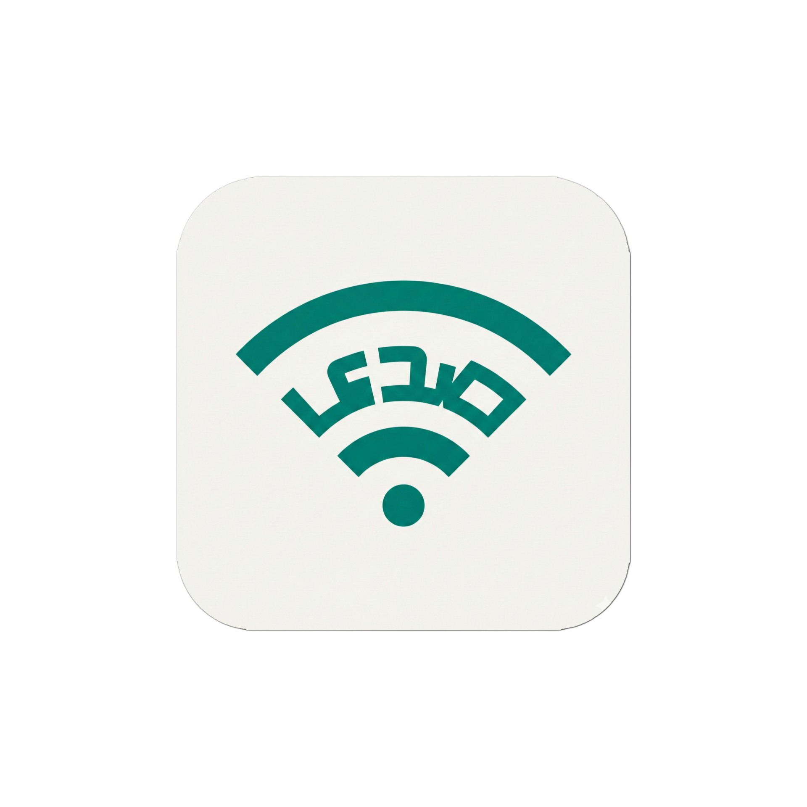

<p align="center">
  
</p>

<h1 align="center">صدى (Sada)</h1>
<p align="center">
  <strong>رسائل Mesh آمنة بدون إنترنت لسوريا</strong>
</p>

<p align="center">
  
  
  
  
  
  
</p>

> **⚠️ الحالة: ألفا / قيد التطوير**
> 
> هذا المشروع قيد التطوير النشط حالياً. خوارزميات توجيه Mesh قيد التحسين.
> 
> **⚠️ تنبيه: هذا برنامج ألفا (v1.0). استخدمه على مسؤوليتك الخاصة. لا تعتمد على هذا التطبيق للاتصالات الحرجة للحياة بعد.**

---

## 📖 حول المشروع

**صدى (Sada)** هو **رسول Mesh لامركزي بدون إنترنت** يتيح التواصل الآمن من نظير إلى نظير دون الحاجة إلى خوادم مركزية أو بنية تحتية للإنترنت. مبني على مبادئ إنسانية، صُمم صدى للمجتمعات في سوريا والمناطق الأخرى التي تعاني من عدم استقرار الاتصال بالإنترنت.

### 🌍 المهمة

في المناطق التي يكون فيها الوصول إلى الإنترنت مقيداً أو غير موثوق أو خاضعاً للرقابة، يوفر صدى شبكة اتصال مرنة تعمل بالكامل بدون إنترنت باستخدام **WiFi Direct (P2P)** و **Bluetooth Low Energy (BLE)**. الرسائل مشفرة من طرف إلى طرف باستخدام **libsodium** (NaCl)، مما يضمن الخصوصية حتى في البيئات المعادية.

### ⚠️ تنبيه ألفا

**هذا برنامج ألفا (v1.0). استخدمه على مسؤوليتك الخاصة.** لا تعتمد على هذا التطبيق للاتصالات الحرجة للحياة بعد. خوارزميات توجيه Mesh لا تزال قيد التحسين.

---

## ✨ الميزات الرئيسية

### 📡 **شبكة Mesh بدون إنترنت**
- **WiFi Direct (P2P)**: اكتشاف والاتصال بالأجهزة القريبة بدون إنترنت
- **Bluetooth LE**: شبكة Mesh احتياطية لمدى أوسع
- **اكتشاف ذكي**: دورة عمل محسّنة للبطارية لاكتشاف الأقران بكفاءة

### 🔒 **تشفير عالي الضمان من طرف إلى طرف**
- **تشفير من طرف إلى طرف**: تبادل مفاتيح **X25519** + تشفير **XSalsa20-Poly1305** (عبر libsodium)
- **السرية المستقبلية**: مفاتيح الجلسة المشتقة باستخدام ECDH و Blake2b
- **تخزين آمن**: المفاتيح الخاصة محفوظة في **FlutterSecureStorage** (Android Keystore)
- **تبادل المفاتيح عبر QR**: مشاركة الهوية والمفتاح العام عبر مسح رمز QR

### 🛡️ **وضع الإكراه (إمكانية الإنكار المعقولة)**
- **نظام PIN مزدوج**: Master PIN (قاعدة بيانات حقيقية) و Duress PIN (قاعدة بيانات وهمية)
- **إمكانية الإنكار المعقولة**: واجهة متطابقة في كلا الوضعين - لا توجد مؤشرات مرئية
- **فصل قاعدة البيانات**: بيانات حقيقية (`sada_encrypted.sqlite`) مقابل بيانات وهمية (`sada_dummy.sqlite`)

### 💾 **قاعدة البيانات المحلية (Drift)**
- **قاعدة بيانات SQLite**: مدعومة بـ **Drift** (سابقاً Moor) لتخزين الرسائل محلياً
- **أولوية عدم الاتصال**: جميع البيانات محفوظة محلياً على الجهاز - لا يوجد مزامنة سحابية
- **دعم وضع الإكراه**: ملفات قاعدة بيانات منفصلة لوضعي Master/Duress

### 🔋 **محسّن للبطارية**
- **دورة عمل ذكية**: أوضاع طاقة قابلة للتكوين (أداء عالي / متوازن / توفير الطاقة)
- **خدمة خلفية**: خدمة أمامية فعالة مع استهلاك بطارية minimal
- **مسح تكيفي**: يعدل تردد الاكتشاف بناءً على تفضيل المستخدم

### 🎨 **واجهة مستخدم حديثة (تصميم Cyber-Stealth)**
- **تصميم Neo-Glass**: أولوية للوضع الداكن مع تأثيرات glassmorphism
- **خلفية Mesh Gradient**: خلفية متحركة خفيفة مع بقع لونية متحركة
- **دعم RTL**: توطين كامل للعربية والإنجليزية
- **تصميم متجاوب**: تخطيطات متجاوبة قائمة على ScreenUtil
- **رسوم متحركة سلسة**: flutter_animate للانتقالات السينمائية

### 👥 **الرسائل الجماعية**
- **مجموعات Mesh**: إنشاء واكتشاف مجموعات عامة/خاصة
- **اكتشاف المجموعات**: واجهة على شكل رادار للعثور على المجتمعات القريبة
- **إدارة الأعضاء**: تتبع أعضاء المجموعة والنشاط

---

## 📸 لقطات الشاشة

| الشاشة الرئيسية | شاشة المحادثة | اكتشاف المجموعات | الإعدادات |
|-----------------|---------------|------------------|-----------|
| *قريباً* | *قريباً* | *قريباً* | *قريباً* |

---

## 🛠️ المكدس التقني

- **الإطار**: Flutter 3.10+
- **إدارة الحالة**: Riverpod (مع توليد الكود)
- **التنقل**: GoRouter
- **قاعدة البيانات**: Drift (SQLite) - تخزين الرسائل/جهات الاتصال محلياً
- **التشفير**: libsodium (NaCl) - X25519 + XSalsa20-Poly1305
- **واجهة المستخدم**: Material 3, flutter_animate, ScreenUtil
- **الأصلي**: Kotlin (Android) - تنفيذ WiFi Direct P2P

## 🚀 البدء

### المتطلبات

- **Flutter SDK**: 3.10.4 أو أحدث
- **Dart SDK**: 3.10.4 أو أحدث
- **Android Studio**: أحدث إصدار مع Android SDK 23+ (للأيقونات التكيفية)
- **Kotlin**: 1.9+ (للكود الأصلي على Android)

### التثبيت

1. **استنساخ المستودع:**
   ```bash
   git clone https://github.com/yourusername/sada.git
   cd sada
   ```

2. **تثبيت التبعيات:**
   ```bash
   flutter pub get
   ```

3. **إنشاء ملفات الترجمة:**
   ```bash
   flutter gen-l10n
   ```

4. **إنشاء الكود (إذا كنت تستخدم code generation):**
   ```bash
   flutter pub run build_runner build --delete-conflicting-outputs
   ```

5. **تشغيل التطبيق:**
   ```bash
   flutter run
   ```

### بناء نسخة الإصدار

```bash
# Android APK
flutter build apk --release

# Android App Bundle
flutter build appbundle --release
```

---

## 🗺️ خارطة الطريق

### ✅ مكتمل

- [x] **الطبقة الأساسية**
  - [x] بنية UI/UX (Material 3، ثيمات داكنة/فاتحة)
  - [x] نظام التنقل (GoRouter مع ShellRoute)
  - [x] التوطين (العربية والإنجليزية مع دعم RTL)
  - [x] التصميم المتجاوب (ScreenUtil)
  - [x] نظام التسجيل

- [x] **المصادقة والأمان**
  - [x] المصادقة بدون إنترنت (معرف مستخدم مرتبط بالجهاز)
  - [x] قفل التطبيق البيومتري (بصمة الإصبع/Face ID)
  - [x] وضع الإكراه (نظام PIN مزدوج)
  - [x] التشفير من طرف إلى طرف (libsodium: X25519 + XSalsa20-Poly1305)
  - [x] إدارة المفاتيح الآمنة (FlutterSecureStorage)

- [x] **الميزات الأساسية**
  - [x] تدفق التعريف بالتطبيق
  - [x] إدارة الصورة الشخصية
  - [x] إنشاء ومسح رمز QR
  - [x] الإشعارات المحلية
  - [x] إدارة الطاقة (دورة العمل)
  - [x] جولة اكتشاف الميزات التفاعلية

- [x] **المجموعات**
  - [x] واجهة إنشاء المجموعة
  - [x] شاشة اكتشاف المجموعات
  - [x] تخزين المجموعات المحلي

- [x] **جسر Android الأصلي**
  - [x] اكتشاف WiFi Direct (P2P)
  - [x] إعداد MethodChannel & EventChannel
  - [x] شاشة Debug للـ Mesh

### 🚧 قيد التنفيذ

- [ ] **تنفيذ Mesh الأصلي**
  - [ ] إدارة اتصال WiFi P2P الكاملة
  - [ ] دعم Mesh Bluetooth LE
  - [ ] بروتوكول توجيه الرسائل
  - [ ] إدارة طوبولوجيا الشبكة

- [x] **طبقة قاعدة البيانات**
  - [x] تكامل Drift (SQLite)
  - [x] استمرارية الرسائل
  - [x] تخزين جهات الاتصال
  - [x] فصل قاعدة بيانات وضع الإكراه

### 📋 مخطط

- [ ] **بروتوكول الرسائل**
  - [ ] تنسيق رسالة Mesh
  - [ ] التوجيه متعدد القفزات
  - [ ] تأكيد تسليم الرسالة
  - [ ] قائمة انتظار الرسائل بدون إنترنت

- [ ] **ميزات متقدمة**
  - [ ] مشاركة الملفات (الصور، المستندات)
  - [ ] الرسائل الصوتية
  - [ ] مشاركة الموقع
  - [ ] تصور خريطة شبكة Mesh

- [ ] **الاختبار والجودة**
  - [ ] اختبارات الوحدة
  - [ ] اختبارات التكامل
  - [ ] اختبارات E2E
  - [ ] تدقيقات الأمان

---

## 📚 التوثيق

للحصول على توثيق تقني مفصل، راجع مجلد [`docs/`](docs/):

### العربية
- **[الهندسة المعمارية](docs/ARCHITECTURE_AR.md)**: بنية النظام وأنماط التصميم
- **[الأمان](docs/SECURITY_AR.md)**: التشفير، وضع الإكراه، وممارسات الأمان
- **[المكدس التقني](docs/TECH_STACK_AR.md)**: المكتبات والتقنيات المستخدمة
- **[المساهمة](docs/CONTRIBUTING_AR.md)**: إرشادات للمساهمين

### English
- **[Architecture](docs/ARCHITECTURE.md)**: System architecture and design patterns
- **[Security](docs/SECURITY.md)**: Encryption, Duress Mode, and security practices
- **[Tech Stack](docs/TECH_STACK.md)**: Libraries and technologies used
- **[Contributing](docs/CONTRIBUTING.md)**: Guidelines for contributors

---

## 🤝 المساهمة

نرحب بالمساهمات! يرجى قراءة [إرشادات المساهمة](docs/CONTRIBUTING_AR.md) قبل إرسال طلبات السحب.

### بدء سريع للمساهمين

1. Fork المستودع
2. إنشاء فرع ميزة (`git checkout -b feature/amazing-feature`)
3. Commit التغييرات (`git commit -m 'إضافة ميزة رائعة'`)
4. Push إلى الفرع (`git push origin feature/amazing-feature`)
5. فتح Pull Request

---

## 📄 الترخيص

هذا المشروع مرخص تحت رخصة MIT - راجع ملف [LICENSE](LICENSE) للتفاصيل.

---

## 🙏 شكر وتقدير

- مبني بـ ❤️ لشعب سوريا
- مستوحى من الحاجة لشبكات اتصال مرنة بدون إنترنت
- شكر خاص لمجتمع المصدر المفتوح للأدوات والمكتبات الرائعة

---

## 👨‍💻 المؤلف

<div align="center">


### Obada Dallo (عبادة دللو)

**المطور الرئيسي والمؤسس**

[](https://github.com/obadadallo95)
[](https://www.linkedin.com/in/obada-dallo-777a47a9/)
[](https://www.facebook.com/obada.dallo33)
[](https://t.me/obada_dallo95)

</div>

---

## 📞 الاتصال والدعم

- **المشاكل**: [GitHub Issues](https://github.com/yourusername/sada/issues)
- **المناقشات**: [GitHub Discussions](https://github.com/yourusername/sada/discussions)

---

<p align="center">
  مبني بـ ❤️ لسوريا
</p>

