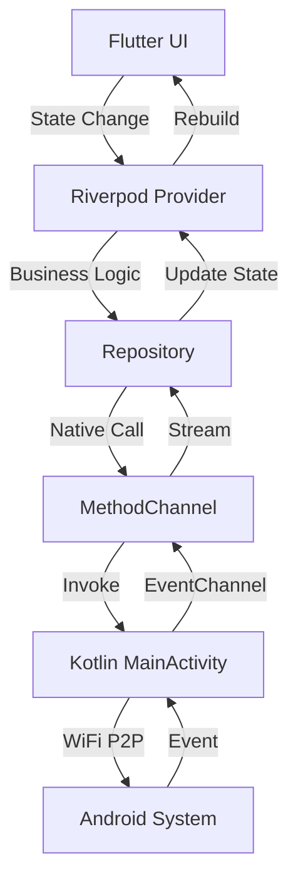
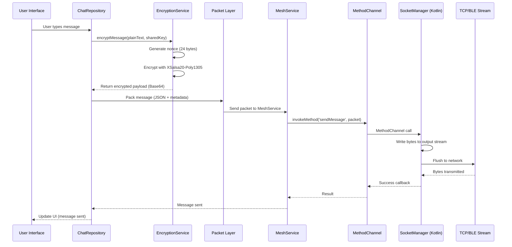
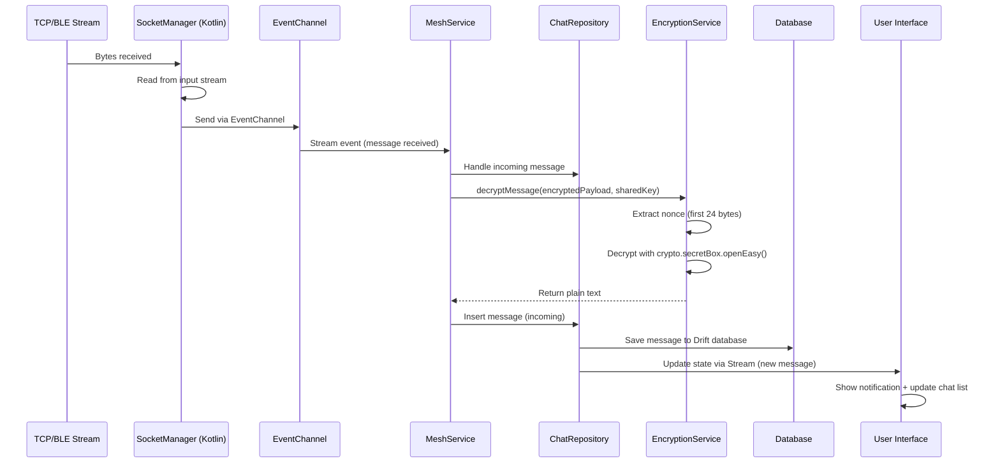

# Architecture Documentation

## Overview

Sada follows **Clean Architecture** principles with a **Feature-First** organization. The application uses a hybrid stack: Flutter for UI and Kotlin for native Android mesh networking services.

---

## Architecture Layers

### 1. **Presentation Layer** (`lib/features/`)

Each feature is self-contained with its own presentation logic:

```
features/
├── auth/
│   └── presentation/
│       └── pages/
│           ├── register_screen.dart
│           └── lock_screen.dart
├── home/
│   └── presentation/
│       └── pages/
│           └── home_screen.dart
├── chat/
│   ├── domain/
│   │   └── models/
│   ├── data/
│   │   └── repositories/
│   └── presentation/
│       ├── pages/
│       └── widgets/
├── groups/
│   ├── data/
│   │   └── groups_repository.dart
│   └── presentation/
│       └── pages/
└── mesh/
    └── presentation/
        └── pages/
            └── mesh_debug_screen.dart
```

**Principles:**
- Each feature is independent and can be developed/tested in isolation
- Presentation layer uses Riverpod for state management
- UI components are reusable and responsive (ScreenUtil)

### 2. **Core Layer** (`lib/core/`)

Shared infrastructure and utilities:

```
core/
├── database/
│   ├── app_database.dart           # Drift database (SQLite)
│   ├── database_provider.dart      # Database provider & Duress Mode logic
│   └── tables/                     # Drift table definitions
│       ├── contacts_table.dart
│       ├── chats_table.dart
│       └── messages_table.dart
├── network/
│   ├── mesh_channel.dart           # Native bridge for WiFi P2P
│   └── mesh_service.dart           # Mesh networking service
├── router/
│   ├── app_router.dart            # GoRouter configuration with Router Guard
│   └── routes.dart                 # Route definitions
├── security/
│   ├── encryption_service.dart     # E2E encryption (libsodium)
│   └── key_manager.dart            # Key pair management
├── services/
│   ├── auth_service.dart           # Authentication & Duress Mode
│   ├── biometric_service.dart      # Biometric lock
│   ├── notification_service.dart   # Local notifications
│   └── background_service.dart     # Power management
├── theme/
│   └── app_theme.dart              # Material 3 theming
├── utils/
│   └── log_service.dart           # Centralized logging
└── widgets/
    └── user_avatar.dart            # Reusable UI components
```

### 3. **Data Layer**

Uses:
- **Drift (SQLite)**: Local database for messages, contacts, and chats
  - `sada_encrypted.sqlite`: Real database (Master PIN)
  - `sada_dummy.sqlite`: Dummy database (Duress PIN)
- **SharedPreferences**: User preferences, onboarding state, power modes
- **FlutterSecureStorage**: Encrypted storage for keys, PINs, user credentials

**Repository Pattern:**
- `ChatRepository`: Manages chats and messages (Drift-based)
- `GroupsRepository`: Manages groups
- Database tables: `ContactsTable`, `ChatsTable`, `MessagesTable`

---

## Hybrid Stack Architecture

### Flutter (UI Layer)

```
┌─────────────────────────────────────┐
│     Flutter UI (Dart)               │
│  ┌───────────────────────────────┐  │
│  │  Riverpod State Management    │  │
│  └───────────────────────────────┘  │
│  ┌───────────────────────────────┐  │
│  │  Repository Pattern           │  │
│  └───────────────────────────────┘  │
└──────────────┬───────────────────────┘
               │ MethodChannel
               │ EventChannel
               ▼
┌─────────────────────────────────────┐
│     Native Android (Kotlin)         │
│  ┌───────────────────────────────┐  │
│  │  WiFi P2P Manager            │  │
│  │  BroadcastReceiver            │  │
│  └───────────────────────────────┘  │
│  ┌───────────────────────────────┐  │
│  │  Background Service           │  │
│  │  Duty Cycle Logic             │  │
│  └───────────────────────────────┘  │
└─────────────────────────────────────┘
```

### Communication Flow



---

## State Management: Riverpod

### Provider Types

1. **StateNotifierProvider**: For complex state (AuthService, ChatRepository)
2. **StateProvider**: For simple state (PowerMode, DiscoveryState)
3. **Provider**: For services and dependencies (Theme, Locale)
4. **FutureProvider**: For async data (ChatList, GroupsList)
5. **StreamProvider**: For real-time data (PeersStream, ConnectionInfo)

### Example: AuthService

```dart
final authServiceProvider = StateNotifierProvider<AuthService, AuthStatus>(
  (ref) => AuthService(),
);
```

---

## Navigation: GoRouter

### Route Structure

- **ShellRoute**: Persistent Bottom Navigation Bar
- **GoRoute**: Individual screens
- **Redirect Logic**: Authentication and Biometric Lock checks

### Route Flow

```
Splash → Onboarding → Register → Lock → Home
                                      ↓
                              ShellRoute (BottomNav)
                              ├── Home
                              ├── Groups
                              ├── Chat
                              └── Settings
```

---

## Security Architecture

### Key Management Flow

```mermaid
graph LR
    A[Device ID] -->|SHA-256| B[Device Hash]
    B -->|Generate| C[Curve25519 KeyPair]
    C -->|Store Private| D[FlutterSecureStorage]
    C -->|Store Public| E[Database (Drift)]
    D -->|Load| F[EncryptionService]
    E -->|Share via QR Code| G[Peer Device]
    G -->|ECDH| H[Shared Secret]
    H -->|Blake2b Hash| I[Session Key]
    I -->|XSalsa20| J[Encrypted Message]
```

### Duress Mode Architecture

```
┌─────────────────────────────────────┐
│         Lock Screen                 │
│  ┌───────────────────────────────┐ │
│  │  PIN Entry (Master/Duress)    │ │
│  └───────────────────────────────┘ │
└──────────────┬──────────────────────┘
               │
               ▼
┌─────────────────────────────────────┐
│      AuthService.verifyPin()         │
│  ┌───────────────────────────────┐  │
│  │  Master PIN → AuthType.master │  │
│  │  Duress PIN → AuthType.duress │  │
│  └───────────────────────────────┘  │
└──────────────┬──────────────────────┘
               │
               ▼
┌─────────────────────────────────────┐
│    DatabaseInitializer               │
│  ┌───────────────────────────────┐  │
│  │  Master → sada_encrypted.db  │  │
│  │  Duress → sada_dummy.db      │  │
│  └───────────────────────────────┘  │
└─────────────────────────────────────┘
```

---

## Message Flow: Lifecycle

The complete lifecycle of a message from user input to network transmission:

### Step-by-Step Flow



### Detailed Flow Description

1. **User Input (UI Layer)**
   - User types a message in `ChatDetailsScreen`
   - Text is captured via `TextField` controller

2. **Repository Layer (`ChatRepository`)**
   - `ChatRepository` receives the plain text message
   - Saves message to **Drift database** with status `sending`
   - Retrieves the recipient's public key from **database** (via `ContactsTable`)
   - Calls `EncryptionService.calculateSharedSecret()` to derive session key

3. **Encryption Layer (`EncryptionService`)**
   - `EncryptionService.encryptMessage()` is called with:
     - Plain text message
     - Session key (derived from ECDH + Blake2b)
   - Generates a random 24-byte nonce using `sodium.randombytes.buf()`
   - Encrypts using `crypto.secretBox.easy()` (XSalsa20-Poly1305)
   - Returns Base64-encoded string: `nonce + ciphertext`

4. **Packet Layer (Message Packing)**
   - Encrypted payload is wrapped in a JSON packet:
     ```json
     {
       "type": "message",
       "chatId": "abc123",
       "senderId": "user456",
       "payload": "base64_encrypted_data",
       "timestamp": 1234567890
     }
     ```
   - Packet is converted to UTF-8 bytes

5. **Mesh Service (Dart)**
   - `MeshService` receives the packet bytes
   - Determines target peer (from connection info)
   - Invokes native method via `MethodChannel`

6. **MethodChannel (Flutter → Kotlin Bridge)**
   - Flutter calls: `methodChannel.invokeMethod('sendMessage', packetBytes)`
   - Kotlin `MainActivity` receives the call

7. **SocketManager (Kotlin Native)**
   - `SocketManager.write()` is called with packet bytes
   - Bytes are written to `Socket.getOutputStream()`
   - Stream is flushed to ensure transmission

8. **Network Layer (TCP/BLE)**
   - Bytes are transmitted over the active connection:
     - **WiFi Direct**: TCP socket on port 8888
     - **Bluetooth LE**: BLE characteristic write (future)
   - Peer device receives bytes on its input stream

### Reverse Flow: Receiving Messages



---

## Native Bridge: MethodChannel & EventChannel

### MethodChannel (Flutter → Kotlin)

**Channel Name**: `org.sada.messenger/mesh`

**Methods:**
- `startDiscovery()`: Start WiFi P2P discovery
- `stopDiscovery()`: Stop discovery
- `getPeers()`: Get current peer list
- `sendMessage(bytes)`: Send message packet to connected peer
- `getApkPath()`: Get APK file path for sharing

### EventChannel (Kotlin → Flutter)

**Channels:**
- `org.sada.messenger/peersChanges`: Stream of peer updates
- `org.sada.messenger/connectionChanges`: Stream of connection info
- `org.sada.messenger/messageEvents`: Stream of received messages

### Implementation Pattern

```kotlin
// Kotlin (MainActivity.kt)
MethodChannel(flutterEngine.dartExecutor.binaryMessenger, METHOD_CHANNEL)
    .setMethodCallHandler { call, result ->
        when (call.method) {
            "startDiscovery" -> {
                wifiP2pManager.discoverPeers(channel, listener)
                result.success(true)
            }
        }
    }
```

```dart
// Dart (mesh_channel.dart)
Future<bool> startDiscovery() async {
  final result = await _methodChannel.invokeMethod<bool>('startDiscovery');
  return result ?? false;
}
```

---

## Database Architecture (Planned)

### Schema Design

```
ChatModel
├── id (String)
├── name (String)
├── isGroup (Boolean)
├── publicKey (String?) // For 1:1 chats
└── groupOwnerId (String?) // For groups

MessageModel
├── id (String)
├── chatId (String)
├── text (String) // Decrypted
├── encryptedText (String?) // Stored encrypted
├── isMe (Boolean)
├── timestamp (DateTime)
└── senderName (String?) // For groups
```

### Duress Mode Database Separation

- **Real Database**: `sada_encrypted.db` (Master PIN)
- **Dummy Database**: `sada_dummy.db` (Duress PIN)
- **Seeding**: Dummy DB automatically populated with fake chats

---

## Power Management Architecture

### Duty Cycle Flow

```
┌─────────────────────────────────────┐
│   Background Service (Foreground)   │
│  ┌───────────────────────────────┐  │
│  │  Timer Loop                   │  │
│  └───────────────────────────────┘  │
│           │                          │
│           ▼                          │
│  ┌───────────────────────────────┐  │
│  │  Read PowerMode               │  │
│  └───────────────────────────────┘  │
│           │                          │
│           ▼                          │
│  ┌───────────────────────────────┐  │
│  │  Calculate Sleep Duration     │  │
│  └───────────────────────────────┘  │
│           │                          │
│           ▼                          │
│  ┌───────────────────────────────┐  │
│  │  Wake → Scan → Sleep          │  │
│  └───────────────────────────────┘  │
└─────────────────────────────────────┘
```

### Power Modes

| Mode | Scan Duration | Sleep Duration |
|------|---------------|----------------|
| High Performance | Continuous | 0 |
| Balanced | 30s | 5 min |
| Low Power | 30s | 15 min |

---

## Best Practices

1. **Feature Isolation**: Each feature is independent
2. **Dependency Injection**: Riverpod providers for all dependencies
3. **Error Handling**: Centralized logging via LogService
4. **Security First**: All sensitive data in FlutterSecureStorage
5. **Responsive Design**: ScreenUtil for all dimensions
6. **Localization**: All UI text via ARB files
7. **Type Safety**: Strong typing with Dart null safety

---

## Future Architecture Considerations

- **Modularization**: Split into feature modules for better build times
- **Offline-First**: All data operations work offline
- **Sync Strategy**: Conflict resolution for mesh message sync
- **Caching**: Smart caching for frequently accessed data
- **Testing**: Unit tests for business logic, Widget tests for UI

