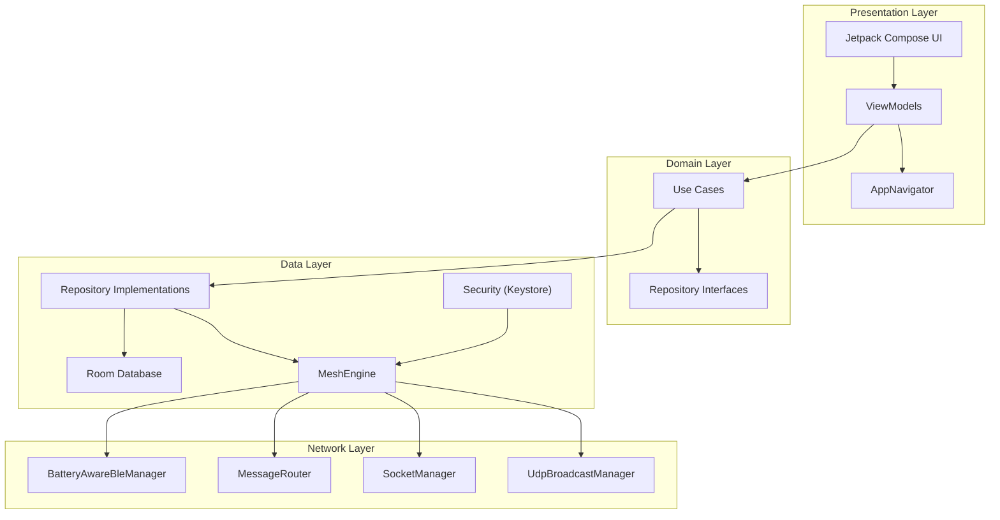

# Sada Architecture (Android Native)

## 1) High-Level Layers (Clean Architecture)

```mermaid
flowchart TD
    subgraph PRESENTATION["Presentation Layer"]
        UI["Jetpack Compose UI"]
        VM["ViewModels"]
        NAV["AppNavigator"]
    end
    
    subgraph DOMAIN["Domain Layer"]
        UC["Use Cases"]
        REPO_I["Repository Interfaces"]
    end
    
    subgraph DATA["Data Layer"]
        REPO_IMPL["Repository Implementations"]
        DB["Room Database"]
        ME["MeshEngine"]
        SEC["Security (Keystore)"]
    end
    
    subgraph NETWORK["Network Layer"]
        BLE["BatteryAwareBleManager"]
        ROUTER["MessageRouter"]
        SM["SocketManager"]
        UDP["UdpBroadcastManager"]
    end
    
    UI --> VM
    VM --> UC
    VM --> NAV
    UC --> REPO_I
    UC --> REPO_IMPL
    REPO_IMPL --> DB
    REPO_IMPL --> ME
    ME --> BLE
    ME --> ROUTER
    ME --> SM
    ME --> UDP
    SEC --> ME
```

## 2) Core Components

### `MainActivity`
- App bootstrap and dependency wiring.
- Builds NavHost and top-level routes.
- Initializes DB, key management, mesh engine, and services.
- Applies locale, RTL/LTR direction, app lock flow, and theme mode.

### `MeshEngine`
- Canonical message transport/routing logic.
- Handshake handling (`HANDSHAKE`, `HANDSHAKE_ACK`).
- Store-Carry-Forward queue management.
- Message ACK processing and status updates.
- Media and voice chunked transfer/reassembly.
- Diagnostics counters (relay active/flushed/ack cleanup, handshake stats).

### `SocketManager`
- Reliable TCP read/write layer.
- 4-byte big-endian frame prefix + payload.
- Server and client modes.
- Read loop and status callbacks.

### `UdpBroadcastManager`
- UDP broadcast discovery on LAN.
- Sends discovery beacons and listens for peers.
- Maintains diagnostics (sent/received/last error/last sender).

### `MeshForegroundService`
- Persistent background runner for mesh discovery/connectivity.
- Foreground notification with controls (Pause/Resume/Stop).
- Keeps mesh alive after app UI is closed.

### `BatteryAwareBleManager` (NEW)
- Battery-optimized BLE scanning (adaptive intervals 5s-60s).
- StrongBox/TEE hardware security detection.
- Power usage estimation and monitoring.
- Connection resilience with automatic retry.

### `MessageRouter` (NEW)
- Store-and-forward routing algorithm.
- DHT-based peer discovery.
- Priority-based message queue.
- TTL management (24-hour message lifetime).
- Duplicate detection (Bloom filter).

### `SecureKeyManager` (NEW)
- Android Keystore integration (TEE/StrongBox).
- ECDH key exchange with Forward Secrecy.
- Key rotation support.
- Hardware-backed security when available.

### `AdvancedEncryptionManager` (NEW)
- AES-256-GCM encryption.
- Random IV generation per message.
- Message signing and verification.
- Group key generation and rotation.

### `AppNavigator` (NEW)
- Centralized navigation management.
- Type-safe screen routes.
- Navigation from ViewModels.
- Deep linking support.

## 3) Data Layer

### Database Version 18
Room database with 18 migrations:
- `contacts`
- `chats` (with restriction settings)
- `messages` (with reply/pin/edit fields)
- `relay_queue`
- `group_members` (with roles)
- `group_join_requests`
- `polls`, `poll_options`, `poll_votes` (NEW)
- `media_chunks`

Migrations explicitly implemented (1..17 -> 17 -> 18), avoiding destructive resets.

Room database (`AppDatabase`, version 8):
- `contacts`
- `chats`
- `messages` (indexed by `chatId`, `timestamp`)
- `relay_queue`
- `group_members`
- `group_join_requests`
- `media_chunks`

Migrations are explicitly implemented (1..7 -> 7 and 7 -> 8), avoiding destructive resets for production upgrade paths.

## 4) Runtime Route Map

Registered routes (NavHost):
- `onboarding`
- `register`
- `home`
- `chats`
- `groups`
- `settings`
- `settings/about`
- `settings/privacy`
- `settings/terms`
- `my_qr`
- `create_group`
- `contacts`
- `chat/{chatId}`
- `diagnostics`
- `crisis_report/{chatId}`

## 5) Architectural Principles
- Offline-first behavior.
- Fail-closed on cryptographic path errors where possible.
- Diagnostics-first engineering for field troubleshooting.
- UI truthfulness: real transport/db state, not static placeholders.
