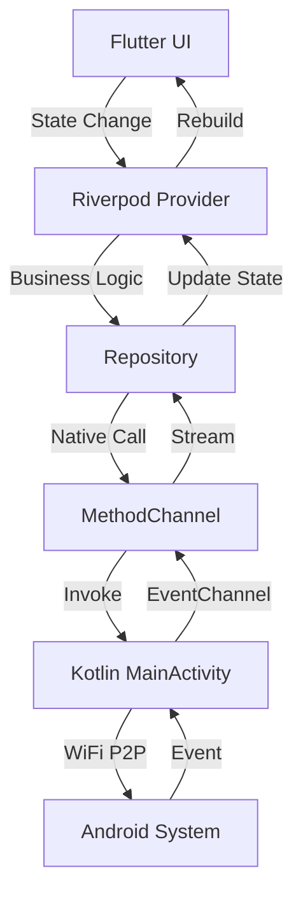
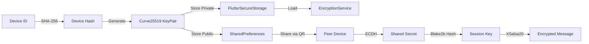
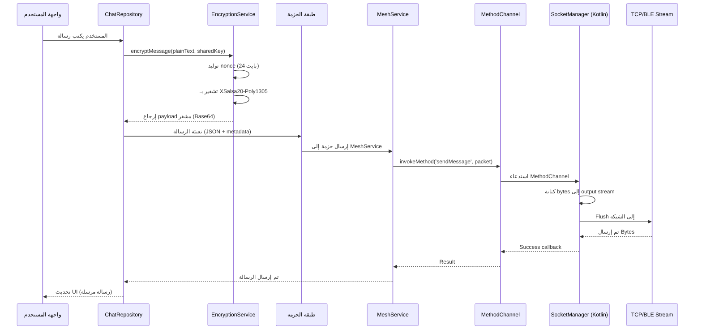
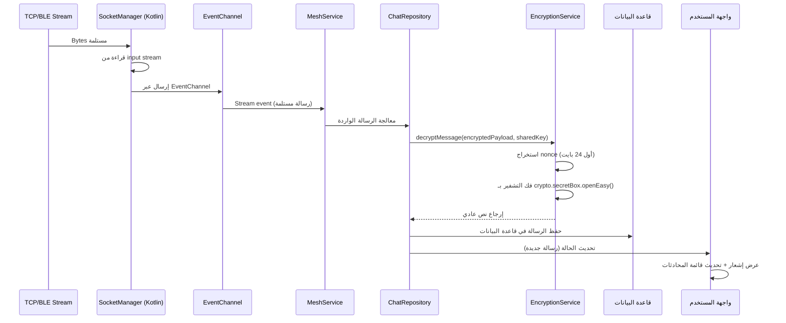

# توثيق الهندسة المعمارية

## نظرة عامة

يتبع صدى مبادئ **الهندسة المعمارية النظيفة** مع تنظيم **قائم على الميزات**. يستخدم التطبيق مكدساً هجيناً: Flutter للواجهة و Kotlin لخدمات شبكة Mesh الأصلية على Android.

---

## طبقات الهندسة المعمارية

### 1. **طبقة العرض** (`lib/features/`)

كل ميزة مستقلة بذاتها مع منطق عرض خاص بها:

```
features/
├── auth/
│   └── presentation/
│       └── pages/
│           ├── register_screen.dart
│           └── lock_screen.dart
├── home/
│   └── presentation/
│       └── pages/
│           └── home_screen.dart
├── chat/
│   ├── domain/
│   │   └── models/
│   ├── data/
│   │   └── repositories/
│   └── presentation/
│       ├── pages/
│       └── widgets/
├── groups/
│   ├── data/
│   │   └── groups_repository.dart
│   └── presentation/
│       └── pages/
└── mesh/
    └── presentation/
        └── pages/
            └── mesh_debug_screen.dart
```

**المبادئ:**
- كل ميزة مستقلة ويمكن تطويرها/اختبارها بمعزل عن غيرها
- طبقة العرض تستخدم Riverpod لإدارة الحالة
- مكونات UI قابلة لإعادة الاستخدام ومتجاوبة (ScreenUtil)

### 2. **الطبقة الأساسية** (`lib/core/`)

البنية التحتية المشتركة والأدوات:

```
core/
├── database/
│   └── database_provider.dart      # تجريد قاعدة البيانات
├── network/
│   └── mesh_channel.dart           # جسر أصلي لـ WiFi P2P
├── router/
│   ├── app_router.dart            # تكوين GoRouter
│   └── routes.dart                 # تعريفات المسارات
├── security/
│   ├── encryption_service.dart     # التشفير من طرف إلى طرف (libsodium)
│   └── key_manager.dart            # إدارة أزواج المفاتيح
├── services/
│   ├── auth_service.dart           # المصادقة
│   ├── biometric_service.dart      # قفل بيومتري
│   ├── notification_service.dart   # الإشعارات المحلية
│   └── background_service.dart     # إدارة الطاقة
├── theme/
│   └── app_theme.dart              # ثيم Material 3
├── utils/
│   └── log_service.dart           # تسجيل مركزي
└── widgets/
    └── user_avatar.dart            # مكونات UI قابلة لإعادة الاستخدام
```

### 3. **طبقة البيانات**

حالياً يستخدم:
- **SharedPreferences**: تفضيلات المستخدم، حالة التعريف، أوضاع الطاقة
- **FlutterSecureStorage**: تخزين مشفر للمفاتيح، PINs، بيانات اعتماد المستخدم
- **قاعدة البيانات المحلية** (مخطط): Drift/Hive للرسائل وسجل المحادثات

---

## هندسة المكدس الهجين

### Flutter (طبقة UI)

```
┌─────────────────────────────────────┐
│     Flutter UI (Dart)               │
│  ┌───────────────────────────────┐  │
│  │  Riverpod State Management    │  │
│  └───────────────────────────────┘  │
│  ┌───────────────────────────────┐  │
│  │  Repository Pattern           │  │
│  └───────────────────────────────┘  │
└──────────────┬───────────────────────┘
               │ MethodChannel
               │ EventChannel
               ▼
┌─────────────────────────────────────┐
│     Native Android (Kotlin)         │
│  ┌───────────────────────────────┐  │
│  │  WiFi P2P Manager            │  │
│  │  BroadcastReceiver            │  │
│  └───────────────────────────────┘  │
│  ┌───────────────────────────────┐  │
│  │  Background Service           │  │
│  │  Duty Cycle Logic             │  │
│  └───────────────────────────────┘  │
└─────────────────────────────────────┘
```

### تدفق الاتصال



---

## إدارة الحالة: Riverpod

### أنواع Providers

1. **StateNotifierProvider**: للحالة المعقدة (AuthService، ChatRepository)
2. **StateProvider**: للحالة البسيطة (PowerMode، DiscoveryState)
3. **Provider**: للخدمات والتبعيات (Theme، Locale)
4. **FutureProvider**: للبيانات غير المتزامنة (ChatList، GroupsList)
5. **StreamProvider**: للبيانات في الوقت الفعلي (PeersStream، ConnectionInfo)

### مثال: AuthService

```dart
final authServiceProvider = StateNotifierProvider<AuthService, AuthStatus>(
  (ref) => AuthService(),
);
```

---

## التنقل: GoRouter

### بنية المسارات

- **ShellRoute**: شريط التنقل السفلي الدائم
- **GoRoute**: الشاشات الفردية
- **منطق إعادة التوجيه**: فحوصات المصادقة وقفل البيومتري

### تدفق المسارات

```
Splash → Onboarding → Register → Lock → Home
                                      ↓
                              ShellRoute (BottomNav)
                              ├── Home
                              ├── Groups
                              ├── Chat
                              └── Settings
```

---

## هندسة الأمان

### تدفق إدارة المفاتيح



### هندسة وضع الإكراه

```
┌─────────────────────────────────────┐
│         Lock Screen                 │
│  ┌───────────────────────────────┐ │
│  │  PIN Entry (Master/Duress)    │ │
│  └───────────────────────────────┘ │
└──────────────┬──────────────────────┘
               │
               ▼
┌─────────────────────────────────────┐
│      AuthService.verifyPin()         │
│  ┌───────────────────────────────┐  │
│  │  Master PIN → AuthType.master │  │
│  │  Duress PIN → AuthType.duress │  │
│  └───────────────────────────────┘  │
└──────────────┬──────────────────────┘
               │
               ▼
┌─────────────────────────────────────┐
│    DatabaseInitializer               │
│  ┌───────────────────────────────┐  │
│  │  Master → sada_encrypted.db  │  │
│  │  Duress → sada_dummy.db      │  │
│  └───────────────────────────────┘  │
└─────────────────────────────────────┘
```

---

## دورة حياة الرسالة: Message Flow

دورة حياة كاملة لرسالة من إدخال المستخدم إلى إرسال الشبكة:

### الخطوات التفصيلية



### وصف التفصيلي

1. **إدخال المستخدم (طبقة UI)**
   - المستخدم يكتب رسالة في `ChatDetailsScreen`
   - النص يُلتقط عبر `TextField` controller

2. **طبقة المستودع (`ChatRepository`)**
   - `ChatRepository` يستقبل رسالة النص العادي
   - يسترجع المفتاح العام للمستقبل (من `ChatModel`)
   - يستدعي `EncryptionService.calculateSharedSecret()` لاشتقاق session key

3. **طبقة التشفير (`EncryptionService`)**
   - يتم استدعاء `EncryptionService.encryptMessage()` مع:
     - رسالة نص عادي
     - Session key (مشتق من ECDH + Blake2b)
   - توليد nonce عشوائي 24 بايت باستخدام `sodium.randombytes.buf()`
   - التشفير باستخدام `crypto.secretBox.easy()` (XSalsa20-Poly1305)
   - إرجاع سلسلة Base64: `nonce + ciphertext`

4. **طبقة الحزمة (تعبئة الرسالة)**
   - الـ payload المشفر يُلف في حزمة JSON:
     ```json
     {
       "type": "message",
       "chatId": "abc123",
       "senderId": "user456",
       "payload": "base64_encrypted_data",
       "timestamp": 1234567890
     }
     ```
   - الحزمة تُحول إلى UTF-8 bytes

5. **خدمة Mesh (Dart)**
   - `MeshService` يستقبل bytes الحزمة
   - يحدد الهدف (من معلومات الاتصال)
   - يستدعي طريقة أصلية عبر `MethodChannel`

6. **MethodChannel (جسر Flutter → Kotlin)**
   - Flutter يستدعي: `methodChannel.invokeMethod('sendMessage', packetBytes)`
   - Kotlin `MainActivity` يستقبل الاستدعاء

7. **SocketManager (Kotlin Native)**
   - يتم استدعاء `SocketManager.write()` مع bytes الحزمة
   - Bytes تُكتب إلى `Socket.getOutputStream()`
   - Stream يُفرغ لضمان الإرسال

8. **طبقة الشبكة (TCP/BLE)**
   - Bytes تُرسل عبر الاتصال النشط:
     - **WiFi Direct**: TCP socket على المنفذ 8888
     - **Bluetooth LE**: BLE characteristic write (مستقبلاً)
   - جهاز النظير يستقبل bytes على input stream الخاص به

### التدفق العكسي: استقبال الرسائل



---

## الجسر الأصلي: MethodChannel & EventChannel

### MethodChannel (Flutter → Kotlin)

**اسم القناة**: `org.sada.messenger/mesh`

**الطرق:**
- `startDiscovery()`: بدء اكتشاف WiFi P2P
- `stopDiscovery()`: إيقاف الاكتشاف
- `getPeers()`: الحصول على قائمة الأقران الحالية
- `sendMessage(bytes)`: إرسال حزمة رسالة إلى النظير المتصل
- `getApkPath()`: الحصول على مسار ملف APK للمشاركة

### EventChannel (Kotlin → Flutter)

**القنوات:**
- `org.sada.messenger/peersChanges`: Stream لتحديثات الأقران
- `org.sada.messenger/connectionChanges`: Stream لمعلومات الاتصال
- `org.sada.messenger/messageEvents`: Stream للرسائل المستلمة

### نمط التنفيذ

```kotlin
// Kotlin (MainActivity.kt)
MethodChannel(flutterEngine.dartExecutor.binaryMessenger, METHOD_CHANNEL)
    .setMethodCallHandler { call, result ->
        when (call.method) {
            "startDiscovery" -> {
                wifiP2pManager.discoverPeers(channel, listener)
                result.success(true)
            }
        }
    }
```

```dart
// Dart (mesh_channel.dart)
Future<bool> startDiscovery() async {
  final result = await _methodChannel.invokeMethod<bool>('startDiscovery');
  return result ?? false;
}
```

---

## هندسة قاعدة البيانات (مخطط)

### تصميم المخطط

```
ChatModel
├── id (String)
├── name (String)
├── isGroup (Boolean)
├── publicKey (String?) // للمحادثات الفردية
└── groupOwnerId (String?) // للمجموعات

MessageModel
├── id (String)
├── chatId (String)
├── text (String) // فك التشفير
├── encryptedText (String?) // محفوظ مشفر
├── isMe (Boolean)
├── timestamp (DateTime)
└── senderName (String?) // للمجموعات
```

### فصل قاعدة البيانات لوضع الإكراه

- **قاعدة البيانات الحقيقية**: `sada_encrypted.db` (Master PIN)
- **قاعدة البيانات الوهمية**: `sada_dummy.db` (Duress PIN)
- **التعبئة**: قاعدة البيانات الوهمية تملأ تلقائياً بمحادثات وهمية

---

## هندسة إدارة الطاقة

### تدفق دورة العمل

```
┌─────────────────────────────────────┐
│   Background Service (Foreground)   │
│  ┌───────────────────────────────┐  │
│  │  Timer Loop                   │  │
│  └───────────────────────────────┘  │
│           │                          │
│           ▼                          │
│  ┌───────────────────────────────┐  │
│  │  Read PowerMode               │  │
│  └───────────────────────────────┘  │
│           │                          │
│           ▼                          │
│  ┌───────────────────────────────┐  │
│  │  Calculate Sleep Duration     │  │
│  └───────────────────────────────┘  │
│           │                          │
│           ▼                          │
│  ┌───────────────────────────────┐  │
│  │  Wake → Scan → Sleep          │  │
│  └───────────────────────────────┘  │
└─────────────────────────────────────┘
```

### أوضاع الطاقة

| الوضع | مدة المسح | مدة النوم |
|------|-----------|-----------|
| أداء عالي | مستمر | 0 |
| متوازن | 30 ثانية | 5 دقائق |
| توفير الطاقة | 30 ثانية | 15 دقيقة |

---

## أفضل الممارسات

1. **عزل الميزات**: كل ميزة مستقلة
2. **حقن التبعيات**: Riverpod providers لجميع التبعيات
3. **معالجة الأخطاء**: تسجيل مركزي عبر LogService
4. **الأمان أولاً**: جميع البيانات الحساسة في FlutterSecureStorage
5. **التصميم المتجاوب**: ScreenUtil لجميع الأبعاد
6. **التوطين**: جميع نصوص UI عبر ملفات ARB
7. **سلامة الأنواع**: كتابة قوية مع Dart null safety

---

## اعتبارات الهندسة المعمارية المستقبلية

- **التوحيد**: تقسيم إلى وحدات ميزات لتحسين أوقات البناء
- **بدون إنترنت أولاً**: جميع عمليات البيانات تعمل بدون إنترنت
- **استراتيجية المزامنة**: حل تعارضات لمزامنة رسائل Mesh
- **التخزين المؤقت**: تخزين مؤقت ذكي للبيانات المستخدمة بشكل متكرر
- **الاختبار**: اختبارات الوحدة لمنطق الأعمال، اختبارات Widget للواجهة

