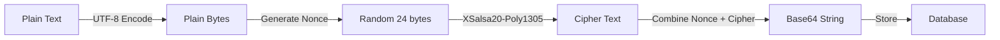

# Security Documentation

## Overview

Sada implements **strong, audited cryptographic primitives** using `libsodium` (NaCl) to protect user privacy and safety in hostile environments. This document details the cryptographic stack, security architecture, and safety features.

**Cryptographic Stack:**
- **Key Exchange:** X25519 (Curve25519)
- **Encryption:** XSalsa20-Poly1305
- **Hashing:** BLAKE2b

---

## 🔐 Encryption Stack

### Library: libsodium (sodium_libs)

Sada uses **libsodium** via the `sodium_libs` Flutter package for all cryptographic operations. libsodium is a modern, easy-to-use software library for encryption, decryption, signatures, password hashing, and more.

**Why libsodium?**
- ✅ Well-audited cryptographic library
- ✅ Protection against timing attacks
- ✅ Constant-time operations
- ✅ Memory-safe APIs
- ✅ Cross-platform support

---

## 🔑 Key Exchange: X25519 (Curve25519)

### Algorithm Details

- **Type**: Elliptic Curve Diffie-Hellman (ECDH)
- **Curve**: Curve25519
- **Key Size**: 256 bits (32 bytes)
- **Security Level**: ~128 bits of security

### Implementation

```dart
// Key Generation (KeyManager)
final seed = sodium.randombytes.buf(sodium.cryptoBox.seedBytes);
final keyPair = sodium.cryptoBox.seedKeyPair(seed: seed);
```

### Key Storage

- **Private Key**: Stored in `FlutterSecureStorage` with `encryptedSharedPreferences: true`
- **Public Key**: Stored in standard SharedPreferences (to be shared via QR code)
- **Key Derivation**: Uses device hash + display name for user ID

---

## 🔒 Message Encryption: XSalsa20-Poly1305

### Algorithm Details

- **Stream Cipher**: XSalsa20 (eXtended Salsa20)
- **MAC**: Poly1305 (authenticated encryption)
- **Nonce Size**: 24 bytes
- **Key Size**: 32 bytes (256 bits)
- **Security**: 128-bit security level

### Encryption Flow



### Implementation

```dart
// Encryption (EncryptionService)
final nonce = sodium.randombytes.buf(sodium.cryptoSecretBox.nonceBytes);
final cipherText = sodium.cryptoSecretBox.encrypt(
  message: plainBytes,
  nonce: nonce,
  key: sharedKey,
);
```

### Decryption Flow

```dart
// Decryption
final combined = base64Decode(encryptedPayload);
final nonce = combined.sublist(0, 24);
final cipherText = combined.sublist(24);
final plainBytes = sodium.cryptoSecretBox.open(
  cipherText: cipherText,
  nonce: nonce,
  key: sharedKey,
);
```

---

## 🔐 Shared Secret Derivation

### ECDH + Hashing

**Step 1: ECDH Key Exchange**
```dart
final sharedSecret = sodium.cryptoScalarMult(
  secretKey: myPrivateKey,
  publicKey: remotePublicKey,
);
```

**Step 2: Blake2b Hashing**
```dart
final sessionKey = sodium.cryptoGenericHash.hash(
  sharedSecret,
  key: null, // No additional key
);
```

**Why Hash?**
- ✅ Prevents key reuse attacks
- ✅ Ensures uniform key distribution
- ✅ Adds forward secrecy properties
- ✅ Standard practice (Signal Protocol)

---

## 🛡️ Duress Mode (Panic System)

### Concept

Duress Mode allows users to enter a **different PIN** that loads a **fake database** with innocent-looking data, protecting real conversations during forced device inspection.

### Architecture

```
┌─────────────────────────────────────┐
│         PIN Entry                   │
│  ┌───────────────────────────────┐ │
│  │  Master PIN: 123456          │ │
│  │  Duress PIN: 999999          │ │
│  └───────────────────────────────┘ │
└──────────────┬──────────────────────┘
               │
               ▼
┌─────────────────────────────────────┐
│    SHA-256 Hash + Salt              │
│  ┌───────────────────────────────┐ │
│  │  Master Hash: abc123...       │ │
│  │  Duress Hash: xyz789...       │ │
│  └───────────────────────────────┘ │
└──────────────┬──────────────────────┘
               │
               ▼
┌─────────────────────────────────────┐
│    AuthService.verifyPin()          │
│  ┌───────────────────────────────┐ │
│  │  Match Master → AuthType.master│ │
│  │  Match Duress → AuthType.duress│ │
│  └───────────────────────────────┘ │
└──────────────┬──────────────────────┘
               │
               ▼
┌─────────────────────────────────────┐
│    Database Selection                │
│  ┌───────────────────────────────┐  │
│  │  Master → sada_encrypted.db  │  │
│  │  Duress → sada_dummy.db      │  │
│  └───────────────────────────────┘  │
└─────────────────────────────────────┘
```

### PIN Storage Security

- **Never stored in plain text**: All PINs are hashed with SHA-256
- **Salt**: Unique salt per user (stored in FlutterSecureStorage)
- **Hash Storage**: Hashes stored in FlutterSecureStorage (encrypted)

```dart
// PIN Hashing
final salt = await _generatePinSalt(); // Unique per user
final combined = '$pin:$salt';
final hash = sha256.convert(utf8.encode(combined));
```

### Dummy Database Seeding

When Duress Mode is activated for the first time, the dummy database is automatically populated with:

- **Fake Contacts**: "Mom", "Football Group", etc.
- **Innocent Messages**: "Don't forget to buy bread", "Match is at 5 PM"
- **Realistic Timestamps**: Messages appear to be recent

**UI Consistency**: The UI is **identical** in both modes - no visual indicators of Duress Mode.

---

## 🔐 Device Binding

### User Identity Generation

**Step 1: Device ID**
- **Android**: `androidId` (or fallback UUID)
- **iOS**: `identifierForVendor` (or fallback UUID)

**Step 2: Device Hash**
```dart
final deviceHash = sha256.convert(utf8.encode(deviceId)).toString();
```

**Step 3: User ID**
```dart
final userIdInput = '$displayName:$deviceHash';
final userId = sha256.convert(utf8.encode(userIdInput)).toString();
```

### Security Properties

- ✅ **Device-Bound**: Account tied to physical device
- ✅ **No Phone Number**: No external verification needed
- ✅ **Privacy**: Device ID is hashed, never logged
- ✅ **Fallback**: UUID if device ID unavailable

---

## 🔒 Secure Storage

### FlutterSecureStorage

**Android Configuration:**
```dart
FlutterSecureStorage(
  aOptions: AndroidOptions(
    encryptedSharedPreferences: true, // Uses Android Keystore
  ),
)
```

**iOS Configuration:**
```dart
iOptions: IOSOptions(
  accessibility: KeychainAccessibility.first_unlock_this_device,
)
```

### What's Stored Securely?

- ✅ **Private Keys**: Curve25519 private keys
- ✅ **PIN Hashes**: Master and Duress PIN hashes
- ✅ **User Credentials**: User ID, display name
- ✅ **Profile Pictures**: Base64 encoded avatars (separate for Master/Duress)

---

## 🔐 Biometric App Lock

### Implementation

- **Library**: `local_auth`
- **Methods**: Fingerprint, Face ID, Iris
- **Storage**: Lock state in SharedPreferences
- **Verification**: Required before enabling/disabling lock

### Security Flow

```
App Launch → Check Lock Enabled?
    │
    ├─ Yes → Lock Screen → Biometric Auth
    │                        │
    │                        ├─ Success → Home
    │                        └─ Failure → Retry
    │
    └─ No → Home
```

---

## 🚨 Security Best Practices

### 1. **Never Log Sensitive Data**

```dart
// ❌ BAD
LogService.info('Device ID: $deviceId');

// ✅ GOOD
LogService.info('Device Hash: ${deviceHash.substring(0, 16)}...');
```

### 2. **Use Secure Random**

```dart
// ✅ Always use libsodium random
final nonce = sodium.randombytes.buf(24);
// ❌ Never use Random()
```

### 3. **Memory Safety**

- Keys are stored securely, not kept in memory longer than necessary
- Sensitive data cleared after use

### 4. **Forward Secrecy**

- Each session derives a new shared secret
- Old session keys cannot decrypt new messages
- Implemented via ECDH + Blake2b hashing

---

## 🔍 Threat Model

### Protected Against

- ✅ **Eavesdropping**: E2E encryption prevents message interception
- ✅ **Man-in-the-Middle**: ECDH key exchange prevents MITM attacks
- ✅ **Device Inspection**: Duress Mode protects against forced inspection
- ✅ **Key Theft**: Private keys stored in hardware-backed secure storage
- ✅ **Message Tampering**: Poly1305 MAC detects tampering

### Limitations

- ⚠️ **Physical Access**: If device is unlocked, data is accessible
- ⚠️ **Keyloggers**: PIN entry can be logged (use biometrics when possible)
- ⚠️ **Screen Recording**: Messages visible on screen can be recorded

---

## ⚠️ What Sada Does NOT Protect You From

### 1. **Compromised Devices**

If your phone has spyware, malware, or a keylogger installed (e.g., Pegasus, commercial spyware), Sada **cannot protect your inputs**. These tools can:

- **Keyloggers**: Capture PIN entries, passwords, and typed messages
- **Screen Recording**: Record everything displayed on your screen
- **Memory Dumps**: Extract encryption keys from device memory if the device is compromised
- **App Injection**: Modify app behavior to exfiltrate data

**Mitigation**: Use a clean, trusted device. Regularly check for suspicious apps and system modifications.

### 2. **Physical Access & Coercion**

If you are **forced to unlock your phone** (e.g., at a checkpoint, during detention), Sada's Duress Mode helps, but **it is not magic**:

- **Duress Mode Limitations**: 
  - If an attacker knows you have Duress Mode, they may force you to enter the Master PIN
  - The UI is identical in both modes, but sophisticated attackers may detect differences in behavior
  - If you are forced to send a message, it will be sent from the active mode (Master or Duress)

- **Biometric Bypass**: If biometrics are enabled, attackers may force you to use fingerprint/Face ID

**Mitigation**: 
- Use Duress Mode as a **last resort**, not a primary defense
- Consider using a separate "burner" device for sensitive communications
- Be aware of your threat model and adjust behavior accordingly

### 3. **Metadata & Traffic Analysis**

While Sada minimizes metadata, **active radio signals** (WiFi Direct, Bluetooth) can be detected and triangulated by sophisticated adversaries with specialized hardware:

- **Signal Detection**: WiFi P2P and Bluetooth signals can be detected by nearby receivers
- **Traffic Analysis**: Patterns of communication (who talks to whom, when) can be analyzed
- **Device Fingerprinting**: Unique device characteristics can be used to identify your device
- **Location Tracking**: Radio signals can be triangulated to determine approximate location

**Mitigation**:
- Use Sada in areas with many active devices (harder to isolate your signal)
- Be aware of your physical environment
- Consider timing your communications to blend with normal traffic patterns

### 4. **Social Engineering**

Sada cannot protect you from:

- **Phishing**: If you share your QR code or public key with an attacker
- **Trust Violations**: If someone you trust shares your messages
- **Impersonation**: If someone gains access to a trusted contact's device

**Mitigation**: Verify identities in person when possible. Use out-of-band verification for sensitive contacts.

### 5. **Implementation Bugs**

Sada is in **Alpha** status. While we use audited cryptographic libraries (`libsodium`), the application code itself:

- Has not undergone a formal security audit
- May contain bugs that could compromise security
- Mesh routing algorithms are still being optimized

**Mitigation**: 
- Do not rely on Sada for life-critical communications yet
- Report security issues responsibly via GitHub Issues
- Wait for a security audit before using in high-risk scenarios

---

## 📋 Security Checklist

- [x] E2E Encryption (XSalsa20-Poly1305)
- [x] Secure Key Exchange (X25519)
- [x] Forward Secrecy (ECDH + Hashing)
- [x] Secure Storage (FlutterSecureStorage)
- [x] Duress Mode (Dual PIN System)
- [x] Biometric Lock
- [x] Device Binding
- [x] No Plain Text PINs
- [x] Secure Random (libsodium)
- [ ] Security Audit (Planned)
- [ ] Penetration Testing (Planned)

---

## 🔗 References

- [libsodium Documentation](https://doc.libsodium.org/)
- [Signal Protocol](https://signal.org/docs/)
- [Curve25519](https://cr.yp.to/ecdh.html)
- [XSalsa20-Poly1305](https://doc.libsodium.org/secret-key_cryptography/secretbox)

