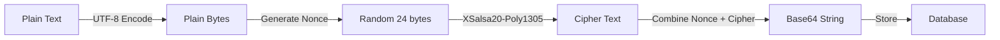

# توثيق الأمان

## نظرة عامة

ينفذ صدى **بدائيات تشفير قوية ومدققة** باستخدام `libsodium` (NaCl) لحماية خصوصية المستخدم وسلامته في البيئات المعادية. يوضح هذا المستند مكدس التشفير، وهندسة الأمان، وميزات السلامة.

**مكدس التشفير:**
- **تبادل المفاتيح:** X25519 (Curve25519)
- **التشفير:** XSalsa20-Poly1305
- **التجزئة:** BLAKE2b

---

## 🔐 مكدس التشفير

### المكتبة: libsodium (sodium_libs)

يستخدم صدى **libsodium** عبر حزمة Flutter `sodium_libs` لجميع العمليات التشفيرية. libsodium هي مكتبة برمجية حديثة وسهلة الاستخدام للتشفير وفك التشفير والتوقيعات وتشفير كلمات المرور والمزيد.

**لماذا libsodium؟**
- ✅ مكتبة تشفير مدققة جيداً
- ✅ الحماية من هجمات التوقيت
- ✅ عمليات ثابتة الوقت
- ✅ واجهات برمجية آمنة للذاكرة
- ✅ دعم متعدد المنصات

---

## 🔑 تبادل المفاتيح: X25519 (Curve25519)

### تفاصيل الخوارزمية

- **النوع**: Elliptic Curve Diffie-Hellman (ECDH)
- **المنحنى**: Curve25519
- **حجم المفتاح**: 256 بت (32 بايت)
- **مستوى الأمان**: ~128 بت من الأمان

### التنفيذ

```dart
// توليد المفاتيح (KeyManager)
final seed = sodium.randombytes.buf(sodium.cryptoBox.seedBytes);
final keyPair = sodium.cryptoBox.seedKeyPair(seed: seed);
```

### تخزين المفاتيح

- **المفتاح الخاص**: محفوظ في `FlutterSecureStorage` مع `encryptedSharedPreferences: true`
- **المفتاح العام**: محفوظ في SharedPreferences العادي (للمشاركة عبر رمز QR)
- **اشتقاق المفتاح**: يستخدم hash الجهاز + اسم العرض لمعرف المستخدم

---

## 🔒 تشفير الرسائل: XSalsa20-Poly1305

### تفاصيل الخوارزمية

- **Stream Cipher**: XSalsa20 (eXtended Salsa20)
- **MAC**: Poly1305 (تشفير مصادق)
- **حجم Nonce**: 24 بايت
- **حجم المفتاح**: 32 بايت (256 بت)
- **الأمان**: مستوى أمان 128 بت

### تدفق التشفير



### التنفيذ

```dart
// التشفير (EncryptionService)
final nonce = sodium.randombytes.buf(sodium.cryptoSecretBox.nonceBytes);
final cipherText = sodium.cryptoSecretBox.encrypt(
  message: plainBytes,
  nonce: nonce,
  key: sharedKey,
);
```

### تدفق فك التشفير

```dart
// فك التشفير
final combined = base64Decode(encryptedPayload);
final nonce = combined.sublist(0, 24);
final cipherText = combined.sublist(24);
final plainBytes = sodium.cryptoSecretBox.open(
  cipherText: cipherText,
  nonce: nonce,
  key: sharedKey,
);
```

---

## 🔐 اشتقاق السر المشترك

### ECDH + Hashing

**الخطوة 1: تبادل مفاتيح ECDH**
```dart
final sharedSecret = sodium.cryptoScalarMult(
  secretKey: myPrivateKey,
  publicKey: remotePublicKey,
);
```

**الخطوة 2: Hashing Blake2b**
```dart
final sessionKey = sodium.cryptoGenericHash.hash(
  sharedSecret,
  key: null, // لا يوجد مفتاح إضافي
);
```

**لماذا Hashing؟**
- ✅ يمنع هجمات إعادة استخدام المفاتيح
- ✅ يضمن توزيعاً موحداً للمفاتيح
- ✅ يضيف خصائص السرية المستقبلية
- ✅ ممارسة قياسية (بروتوكول Signal)

---

## 🛡️ وضع الإكراه (نظام الذعر)

### المفهوم

يسمح وضع الإكراه للمستخدمين بإدخال **PIN مختلف** يحمّل **قاعدة بيانات وهمية** ببيانات تبدو بريئة، لحماية المحادثات الحقيقية أثناء فحص الجهاز القسري.

### الهندسة المعمارية

```
┌─────────────────────────────────────┐
│         PIN Entry                   │
│  ┌───────────────────────────────┐ │
│  │  Master PIN: 123456          │ │
│  │  Duress PIN: 999999          │ │
│  └───────────────────────────────┘ │
└──────────────┬──────────────────────┘
               │
               ▼
┌─────────────────────────────────────┐
│    SHA-256 Hash + Salt              │
│  ┌───────────────────────────────┐ │
│  │  Master Hash: abc123...       │ │
│  │  Duress Hash: xyz789...       │ │
│  └───────────────────────────────┘ │
└──────────────┬──────────────────────┘
               │
               ▼
┌─────────────────────────────────────┐
│    AuthService.verifyPin()          │
│  ┌───────────────────────────────┐  │
│  │  Match Master → AuthType.master│ │
│  │  Match Duress → AuthType.duress│ │
│  └───────────────────────────────┘  │
└──────────────┬──────────────────────┘
               │
               ▼
┌─────────────────────────────────────┐
│    Database Selection                │
│  ┌───────────────────────────────┐  │
│  │  Master → sada_encrypted.db  │  │
│  │  Duress → sada_dummy.db      │  │
│  └───────────────────────────────┘  │
└─────────────────────────────────────┘
```

### أمان تخزين PIN

- **لا يُحفظ أبداً كنص عادي**: جميع PINs مشفرة بـ SHA-256
- **Salt**: Salt فريد لكل مستخدم (محفوظ في FlutterSecureStorage)
- **تخزين Hash**: Hashes محفوظة في FlutterSecureStorage (مشفرة)

```dart
// تشفير PIN
final salt = await _generatePinSalt(); // فريد لكل مستخدم
final combined = '$pin:$salt';
final hash = sha256.convert(utf8.encode(combined));
```

### تعبئة قاعدة البيانات الوهمية

عند تفعيل وضع الإكراه لأول مرة، يتم ملء قاعدة البيانات الوهمية تلقائياً بـ:

- **جهات اتصال وهمية**: "أم"، "مجموعة كرة القدم"، إلخ.
- **رسائل بريئة**: "لا تنس شراء الخبز"، "المباراة في الساعة 5 مساءً"
- **طوابع زمنية واقعية**: الرسائل تظهر حديثة

**اتساق UI**: الواجهة **متطابقة** في كلا الوضعين - لا توجد مؤشرات مرئية لوضع الإكراه.

---

## 🔐 ربط الجهاز

### توليد هوية المستخدم

**الخطوة 1: معرف الجهاز**
- **Android**: `androidId` (أو UUID احتياطي)
- **iOS**: `identifierForVendor` (أو UUID احتياطي)

**الخطوة 2: Hash الجهاز**
```dart
final deviceHash = sha256.convert(utf8.encode(deviceId)).toString();
```

**الخطوة 3: معرف المستخدم**
```dart
final userIdInput = '$displayName:$deviceHash';
final userId = sha256.convert(utf8.encode(userIdInput)).toString();
```

### خصائص الأمان

- ✅ **مرتبط بالجهاز**: الحساب مرتبط بالجهاز المادي
- ✅ **لا يوجد رقم هاتف**: لا حاجة للتحقق الخارجي
- ✅ **الخصوصية**: معرف الجهاز مشفر، لا يُسجل أبداً
- ✅ **احتياطي**: UUID إذا كان معرف الجهاز غير متاح

---

## 🔒 التخزين الآمن

### FlutterSecureStorage

**تكوين Android:**
```dart
FlutterSecureStorage(
  aOptions: AndroidOptions(
    encryptedSharedPreferences: true, // يستخدم Android Keystore
  ),
)
```

**تكوين iOS:**
```dart
iOptions: IOSOptions(
  accessibility: KeychainAccessibility.first_unlock_this_device,
)
```

### ما الذي يُحفظ بشكل آمن؟

- ✅ **المفاتيح الخاصة**: مفاتيح Curve25519 الخاصة
- ✅ **PIN Hashes**: Hashes Master و Duress PIN
- ✅ **بيانات اعتماد المستخدم**: معرف المستخدم، اسم العرض
- ✅ **الصور الشخصية**: صور Base64 مشفرة (منفصلة لـ Master/Duress)

---

## 🔐 قفل التطبيق البيومتري

### التنفيذ

- **المكتبة**: `local_auth`
- **الطرق**: بصمة الإصبع، Face ID، القزحية
- **التخزين**: حالة القفل في SharedPreferences
- **التحقق**: مطلوب قبل تفعيل/تعطيل القفل

### تدفق الأمان

```
App Launch → Check Lock Enabled?
    │
    ├─ Yes → Lock Screen → Biometric Auth
    │                        │
    │                        ├─ Success → Home
    │                        └─ Failure → Retry
    │
    └─ No → Home
```

---

## 🚨 أفضل ممارسات الأمان

### 1. **عدم تسجيل البيانات الحساسة أبداً**

```dart
// ❌ سيء
LogService.info('Device ID: $deviceId');

// ✅ جيد
LogService.info('Device Hash: ${deviceHash.substring(0, 16)}...');
```

### 2. **استخدام Random الآمن**

```dart
// ✅ دائماً استخدم libsodium random
final nonce = sodium.randombytes.buf(24);
// ❌ لا تستخدم Random() أبداً
```

### 3. **أمان الذاكرة**

- المفاتيح محفوظة بشكل آمن، لا تُحفظ في الذاكرة أطول من اللازم
- البيانات الحساسة تُمسح بعد الاستخدام

### 4. **السرية المستقبلية**

- كل جلسة تستمد سراً مشتركاً جديداً
- مفاتيح الجلسة القديمة لا يمكنها فك تشفير الرسائل الجديدة
- مُنفذ عبر ECDH + Blake2b hashing

---

## 🔍 نموذج التهديد

### محمي ضد

- ✅ **التنصت**: التشفير من طرف إلى طرف يمنع اعتراض الرسائل
- ✅ **Man-in-the-Middle**: تبادل مفاتيح ECDH يمنع هجمات MITM
- ✅ **فحص الجهاز**: وضع الإكراه يحمي من الفحص القسري
- ✅ **سرقة المفاتيح**: المفاتيح الخاصة محفوظة في تخزين آمن مدعوم بالأجهزة
- ✅ **التلاعب بالرسائل**: Poly1305 MAC يكتشف التلاعب

### القيود

- ⚠️ **الوصول المادي**: إذا كان الجهاز غير مقفل، البيانات قابلة للوصول
- ⚠️ **Keyloggers**: إدخال PIN يمكن تسجيله (استخدم البيومتري عند الإمكان)
- ⚠️ **تسجيل الشاشة**: الرسائل المرئية على الشاشة يمكن تسجيلها

---

## ⚠️ ما لا يحميك منه صدى

### 1. **الأجهزة المخترقة**

إذا كان هاتفك يحتوي على برامج تجسس أو برامج ضارة أو keylogger مثبتة (مثل Pegasus، برامج تجسس تجارية)، صدى **لا يمكنه حماية مدخلاتك**. هذه الأدوات يمكنها:

- **Keyloggers**: التقاط إدخالات PIN وكلمات المرور والرسائل المكتوبة
- **تسجيل الشاشة**: تسجيل كل ما يُعرض على شاشتك
- **Memory Dumps**: استخراج مفاتيح التشفير من ذاكرة الجهاز إذا كان الجهاز مخترقاً
- **حقن التطبيق**: تعديل سلوك التطبيق لاستخراج البيانات

**التخفيف**: استخدم جهازاً نظيفاً وموثوقاً. تحقق بانتظام من التطبيقات المشبوهة وتعديلات النظام.

### 2. **الوصول المادي والإكراه**

إذا تم **إجبارك على فتح قفل هاتفك** (مثلاً عند نقطة تفتيش، أثناء الاحتجاز)، وضع الإكراه في صدى يساعد، لكن **ليس سحراً**:

- **قيود وضع الإكراه**: 
  - إذا عرف المهاجم أن لديك وضع إكراه، قد يجبرك على إدخال Master PIN
  - الواجهة متطابقة في كلا الوضعين، لكن المهاجمين المتطورين قد يكتشفون اختلافات في السلوك
  - إذا تم إجبارك على إرسال رسالة، سيتم إرسالها من الوضع النشط (Master أو Duress)

- **تجاوز البيومتري**: إذا كانت البيومتري مفعلة، قد يجبرك المهاجمون على استخدام البصمة/Face ID

**التخفيف**: 
- استخدم وضع الإكراه كـ **ملاذ أخير**، وليس دفاعاً أساسياً
- فكر في استخدام جهاز منفصل "احتراقي" للاتصالات الحساسة
- كن على دراية بنموذج التهديد الخاص بك وعدّل السلوك accordingly

### 3. **البيانات الوصفية وتحليل حركة المرور**

بينما يقلل صدى البيانات الوصفية، **إشارات الراديو النشطة** (WiFi Direct، Bluetooth) يمكن اكتشافها وتثليثها من قبل خصوم متطورين بأجهزة متخصصة:

- **اكتشاف الإشارة**: إشارات WiFi P2P و Bluetooth يمكن اكتشافها بواسطة مستقبلات قريبة
- **تحليل حركة المرور**: أنماط الاتصال (من يتحدث مع من، متى) يمكن تحليلها
- **بصمة الجهاز**: خصائص الجهاز الفريدة يمكن استخدامها لتحديد جهازك
- **تتبع الموقع**: إشارات الراديو يمكن تثليثها لتحديد الموقع التقريبي

**التخفيف**:
- استخدم صدى في مناطق بها أجهزة نشطة كثيرة (أصعب لعزل إشارتك)
- كن على دراية ببيئتك المادية
- فكر في توقيت اتصالاتك للاندماج مع أنماط حركة المرور العادية

### 4. **الهندسة الاجتماعية**

صدى لا يمكنه حمايتك من:

- **التصيد الاحتيالي**: إذا شاركت رمز QR أو المفتاح العام مع مهاجم
- **انتهاكات الثقة**: إذا شارك شخص تثق به رسائلك
- **انتحال الشخصية**: إذا حصل شخص ما على الوصول إلى جهاز جهة اتصال موثوقة

**التخفيف**: تحقق من الهويات شخصياً عند الإمكان. استخدم التحقق خارج النطاق للجهات الحساسة.

### 5. **أخطاء التنفيذ**

صدى في حالة **ألفا**. بينما نستخدم مكتبات تشفير مدققة (`libsodium`)، كود التطبيق نفسه:

- لم يخضع لتدقيق أمني رسمي
- قد يحتوي على أخطاء قد تهدد الأمان
- خوارزميات توجيه Mesh لا تزال قيد التحسين

**التخفيف**: 
- لا تعتمد على صدى للاتصالات الحرجة للحياة بعد
- أبلغ عن مشاكل الأمان بمسؤولية عبر GitHub Issues
- انتظر تدقيقاً أمنياً قبل الاستخدام في سيناريوهات عالية المخاطر

---

## 📋 قائمة التحقق الأمنية

- [x] التشفير من طرف إلى طرف (XSalsa20-Poly1305)
- [x] تبادل مفاتيح آمن (X25519)
- [x] السرية المستقبلية (ECDH + Hashing)
- [x] التخزين الآمن (FlutterSecureStorage)
- [x] وضع الإكراه (نظام PIN مزدوج)
- [x] قفل بيومتري
- [x] ربط الجهاز
- [x] لا توجد PINs كنص عادي
- [x] Random آمن (libsodium)
- [ ] تدقيق أمني (مخطط)
- [ ] اختبار الاختراق (مخطط)

---

## 🔗 المراجع

- [توثيق libsodium](https://doc.libsodium.org/)
- [بروتوكول Signal](https://signal.org/docs/)
- [Curve25519](https://cr.yp.to/ecdh.html)
- [XSalsa20-Poly1305](https://doc.libsodium.org/secret-key_cryptography/secretbox)

